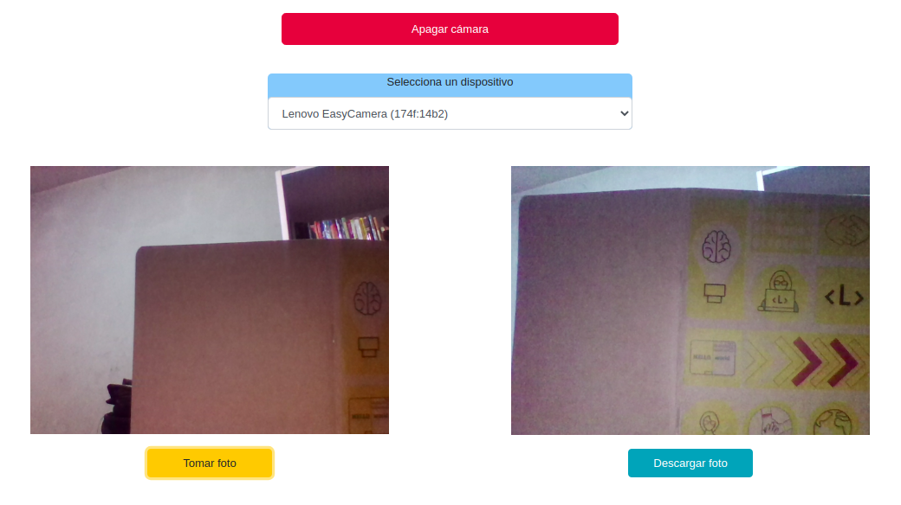

<h1 align="center">Camera Js</h1>

Cámara web que detecta múltiples dispositivos de video disponibles.

## Descripción

- Detecta dispositivos de videos disponibles.
- Permite descargar la fotografía tomada.
- Probado en desktop, móvil, y tablet.

## Demos

- **View camera inactive**

- **View camera active**

## Sobre el proyecto

- Implementado en `Vanilla`.
- Otras tecnologías: `Bootstrap`, `Css` y `Html`.
- Desplegado en `gh-pages`.

## Créditos

Créditos al autor [parzibyte](https://github.com/parzibyte).

## Licencia

Copyleft 🄯 2020, MIT.
